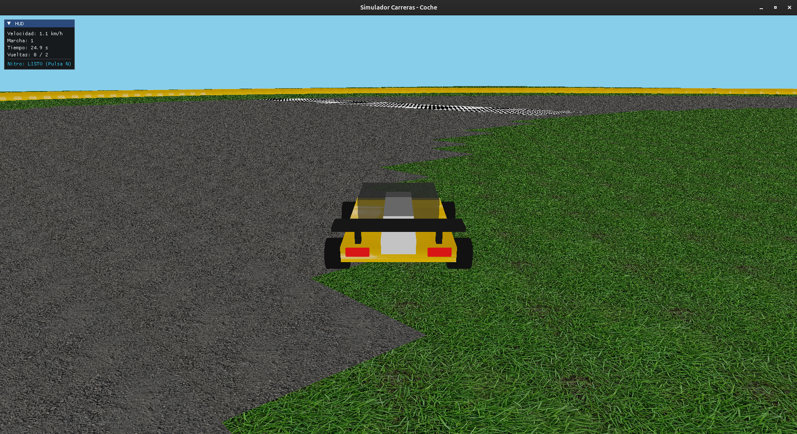
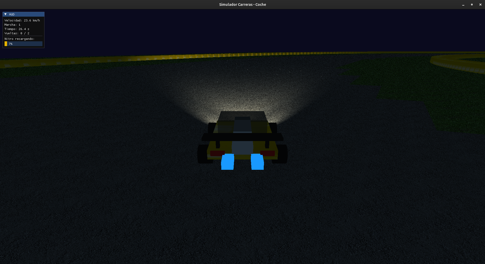
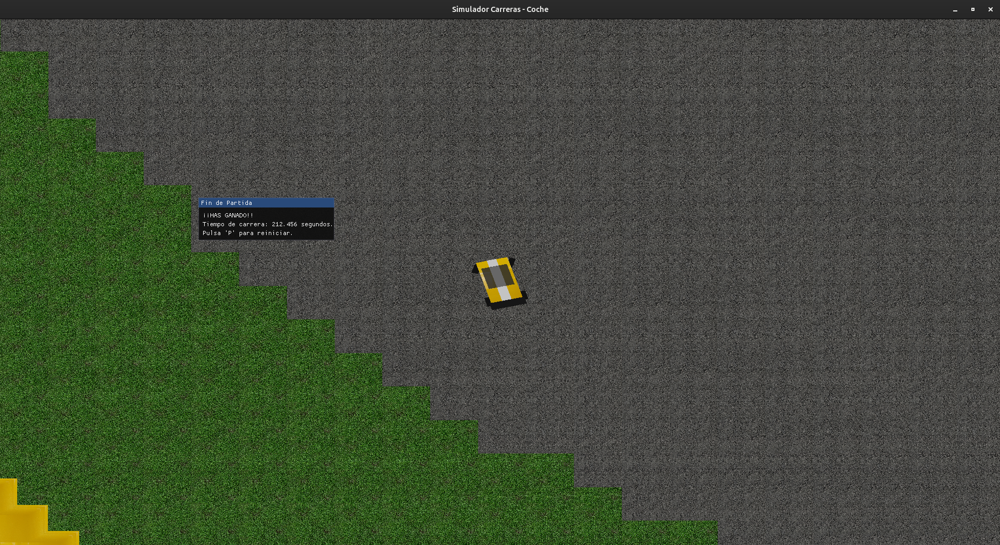

# Informe Técnico: Juego de Carreras 3D en OpenGL

Este informe explica el funcionamiento del proyecto **Juego de Carreras**. El objetivo principal del proyecto es crear juego de conducción tipo arcade, con una pista cerrada, físicas básicas de movimiento, sistema de vueltas, iluminación dinámica, cámaras y una interfaz en pantalla para mostrar información al jugador.

## 1. Visión general del proyecto y librerías utilizadas

El juego consiste en completar dos vueltas a un circuito cerrado en el menor tiempo posible. El jugador controla un coche con comportamiento arcade, es decir, no se busca una simulación totalmente realista, sino una conducción sencilla e intuitiva.

El coche puede acelerar `(W)`, frenar `(S)`, girar `(A,D)`, cambiar de marcha `(ARRIBA, ABAJO)`, usar nitro `(N)`, salirse de la pista y volver a ella. Además, el escenario incluye cambios entre día y noche `(T)`, faros `(F)`, una cámara en distintas posiciones `(BOTONES 1,2,3)` y un HUD que muestra datos importantes durante la carrera.

Para desarrollar el proyecto se han utilizado varias librerías:

- **OpenGL y GLAD:** Librerias estandar basicas para dibujar los objetos 3D en pantalla.
- **GLFW:** Para crear la ventana del juego y detectar la entrada del teclado.
- **GLM:** Para cálculos matemáticos necesarios para mover, rotar y escalar objetos en 3D.
- **stb_image:** Para cargar imágenes y usarlas como texturas.
- **ImGui:** Esta es una libreria nueva, nunca utilizada durante las practicas, pero que nos permitirá crear la interfaz que durante la ejecución muestre información como la velocidad actual, la marcha u otras estadísticas que nos permitan. Más información en el repo oficial de donde la descargamos--> (https://github.com/ocornut/imgui)

## 2. Organización del código y archivos principales

Por un lado está la lógica principal del juego, por otro la geometría de los objetos, y por otro los shaders.

### 2.1 `main.cpp`

En el `main.cpp` se inicializa la ventana, se configuran las librerías, se cargan los recursos y se ejecuta el bucle principal del juego. Además, en este archivo se controlan variables generales del juego, como el tiempo de carrera, el estado de noche o día, el uso del nitro, la posición del coche y el número de vueltas completadas.

Se ha puesto en práctica el uso de una variable `DeltaTime`, que mide el tiempo transcurrido entre fotogramas. Esto es importante porque evita que el coche se mueva más rápido o más lento dependiendo del rendimiento del ordenador como se vió en clase. De esta forma, la velocidad y los giros se mantienen estables aunque cambien los FPS.

### 2.2 Geometría y `geometria_coche.h`

El proyecto los objetos lso construimos usando figuras básicas como cubos, cilindros y esferas. Esto nos facilita enormemente la tarea de crear cada parte del escenario.

En el archivo `geometria_coche.h` se define la geometría base del coche y de algunos objetos. Por ejemplo, se utiliza un array de vértices para representar cubos.

Las normales son necesarias para que la iluminación funcione correctamente, ya que indican hacia dónde mira cada cara del objeto. Las coordenadas de textura sirven para colocar imágenes sobre las superficies.

También se genera la geometría de las ruedas mediante una función que crea cilindros. En vez de escribir todos los puntos manualmente, el código calcula la forma circular usando funciones trigonométricas como `sin` y `cos`. Así conseguimos una rueda redonda formada por varios segmentos.

### 2.3 Shaders

El **vertex shader** transforma los vértices de cada objeto. Los coloca en su posición local, después en el mundo 3D, luego en relación con la cámara y finalmente en la pantalla. También calcula correctamente las normales de los objetos para que la luz no se deforme cuando una figura se escala o se rota.

El **fragment shader** decide el color final de cada punto visible en pantalla. en el combinamos la textura del objeto, la iluminación y la transparencia. Esto permite que los objetos no se vean planos y que reaccionen a la luz de forma más realista. También se incluyen focos tipo faro, con una dirección y un ángulo de apertura, para simular la luz que sale desde la parte delantera del coche, tal y como se vió en el proyecto de la grua. Cabe destacar que algunos objetos no dependen de la luz externa, sino que parecen emitir luz propia, como ocurre con el fuego azul del nitro.

## 3. Físicas del coche y controles

El movimiento del coche se gestiona principalmente en la función `actualizarFisicas()`. Esta parte del código calcula cómo cambia la posición, la velocidad y la orientación del coche según las teclas pulsadas y el estado actual del vehículo. El coche además dispone de inercia, marchas, aceleración e incluso pierde velocidad cuando sale del asfalto y tiene implementado un sistema de colisión con los bordes del circuito.

### Dirección

El jugador puede girar usando las teclas **A** y **D**. El giro del volante tiene un límite, de manera que no se puede girar infinitamente. Cuando el jugador deja de pulsar la tecla, el volante vuelve automáticamente al centro. Esto hace que el control sea más cómodo y evita que el coche se quede girando demasiado tiempo después de soltar la tecla.

### Marchas

El coche tiene **seis marchas**, cada una con una velocidad máxima distinta. La primera marcha permite poca velocidad, mientras que la sexta permite alcanzar la velocidad máxima normal. El jugador puede cambiar de marcha manualmente usando las flechas **ARRIBA** y **ABAJO**. Además, si el coche pierde mucha velocidad, el sistema reduce automáticamente a una marcha inferior para adaptarse mejor a la velocidad actual.

### Asfalto y hierba

El circuito diferencia entre zonas de asfalto y zonas de hierba. Mientras el coche está dentro de la pista, puede alcanzar su velocidad normal. Sin embargo, si se sale del asfalto, la velocidad máxima se reduce. Esto funciona como una penalización para el jugador.

## 4. Sistema de nitro

El juego incluye un sistema de **nitro**, activado con la tecla **N**. Esta función permite al coche ganar velocidad durante un corto periodo de tiempo.

Al usar el nitro, la velocidad del coche aumenta durante unos segundos y permite superar el límite normal de velocidad. Para evitar que el nitro se use constantemente, se ha añadido un tiempo de recarga. Después de activarlo, el jugador debe esperar varios segundos antes de poder volver a usarlo.

## 5. Diseño del escenario

El escenario no está formado por un modelo 3D fijo cargado desde un archivo. En su lugar, se genera mediante código dentro de la función `dibujarEntorno()`.

El terreno se dibuja por secciones, para cada sección, el programa calcula si esa zona pertenece al asfalto, a la hierba, a los muros o a la línea de meta. La forma de la pista se calcula usando una función matemática que crea un recorrido en forma de elipse (tal y como trazabamos las orbitas de los planetas en el sistema solar). Además se añaden muros alrededor de la pista. La línea de meta se representa con una textura de cuadros y es el punto de partida inicial.

## 6. Interfaz del juego

La interfaz se ha creado usando **ImGui**. Esta librería nueva nos permite dibujar un panel encima de la escena 3D para mostrar información sin necesidad de imprimirla via terminal. En pantalla se muestran datos útiles para el jugador, como la velocidad, la marcha actual, el tiempo de carrera o el estado del nitro. 

También se ha añadido información por consola para depuración. El programa imprime datos importantes del estado del coche y del juego sin llenar la terminal con demasiadas líneas.

## 7. Iluminación, texturas y efectos visuales

El proyecto incluye varios efectos visuales que hemos podido crear gracias al contenido de las anteriores prácticas.

### Cielo dinámico

El cielo se representa mediante una esfera grande que rodea la escena. Esta esfera se mueve junto con la cámara, por lo que da la sensación de estar siempre a mucha distancia.

### Modo noche

El juego permite cambiar entre día y noche usando la tecla **T**. Cuando se activa el modo noche, la luz ambiental se reduce y el escenario se ve más oscuro.

### Faros del coche

Los faros se activan con la tecla **F**. Funcionan como dos focos colocados en la parte delantera del coche. Su posición y dirección se actualizan según la posición y la rotación del vehículo.

### Fuego del nitro

Cuando se usa el nitro, aparece un efecto visual de "fuego" en la parte trasera del coche. Este "fuego" se ve brillante aunque la escena esté oscura. Se ha hecho de tal forma que este fuego se dibuje como un cubo que cambia de tamaño poco a poco.

## 8. Cámaras del juego

El simulador incluye varias cámaras que el jugador puede cambiar durante la partida.

1) **Cámara de persecución**: sigue al coche desde atrás y desde cierta altura. Es la vista principal, ya que permite ver bien el vehículo y la pista.

2) **Cámara en primera persona**: colocada cerca del coche para dar una sensación más cercana a la conducción desde dentro del vehículo.

3) **Cámara cenital**: situada muy por encima del escenario. Esta vista permite observar el circuito desde arriba. Además, puede activarse al terminar la carrera para mostrar mejor el resultado final.

## 9. Sistema de vueltas y final de carrera

El juego controla cuándo el coche cruza la línea de meta. Para evitar contar vueltas falsas, no basta con pasar cerca de la línea, sino que se comprueba también la dirección del coche y el momento exacto del cruce.

Cuando el coche cruza correctamente la meta, se actualiza el número de vueltas completadas. Al llegar a la segunda vuelta, la carrera termina y se muestra el resultado.

## Imagenes de ejemplo

